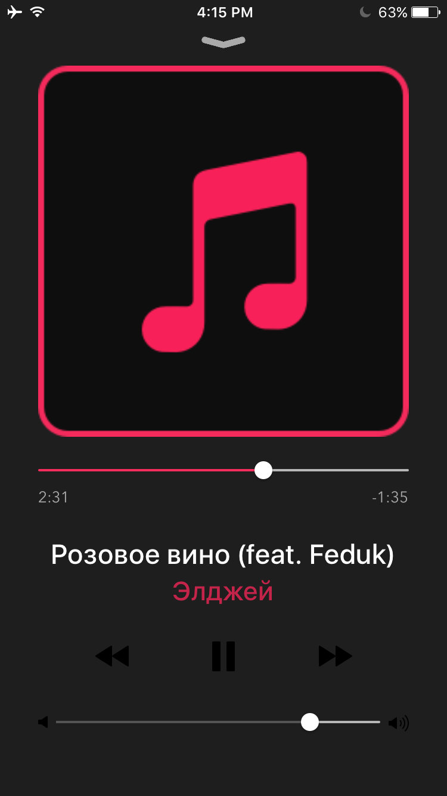
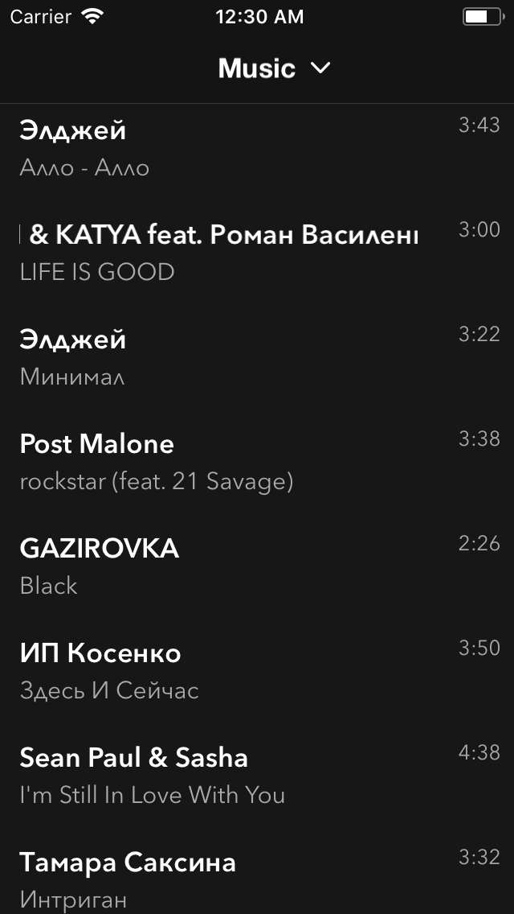

# Muzonchik 

Used to be VK based app that used VK API to search and downloaded music. Since VK closed that feauture I found another way that let you search, download music. 

##**Requirements**
* Swift 4.0+
* iOS 9.0+ 
* Xcode 9.2+

## If you like the project and would like to see more updates and bug fixes down the line I would really appreciate some donations! Support Developers. 

<pre>
Features: 
✔ Downloading music with swipe to the right guesture
✔ Simplified music player interface
✔ Mini Player at the bottom indicates current track info
✔ Music not getting stoped when recording a video

Фишки:
✔ Дизайн приближенный к родному приложению ВК 
✔ Загрузка музыки путем свайпа вправо
✔ Упрощенный плеер
✔ Мини плеер внизу, отображающий текущий проигрываемый трек
✔ Музыка не прерывается при записи видео
</pre>

If you have any comments, concerns, feauture request or bugs that needs to be fixed let me know.
Also, if you need signed .ipa file that you can share with you friends let me know
My VK page https://vk.com/kotobaron

## Check out my new app Eclipse Chat on the App Store 
https://itunes.apple.com/us/app/shadow-meet-people-chat-anonymously/id1187144458?mt=8

